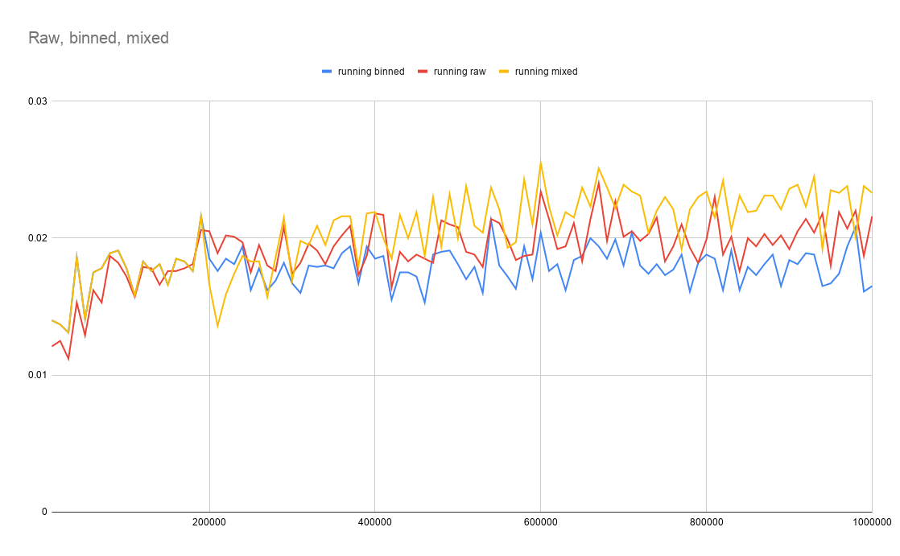

# 2019 Criteo Recogym Challenge - Winning agent
## Introduction
Over the months of October and November 2019, Criteo organized [the 2019 RecoGym challenge](https://sites.google.com/view/recogymchallenge/home),
a challenge where you build an agent that tries to predict the best product to show to a user given his past product views on a website (organic data) and 
past views & clicks on advertisements (bandit data). The goal is for your agent to have the highest click-through rate on products it recommends.

The Recogym agent in `MultinomialNBAgent.py` was my last submission as _bx_ to this challenge and ended up 
[winning](https://sites.google.com/view/recogymchallenge/home/winner-of-the-recogym-100-challenge) the
contest. Below you'll find instructions on how to run this agent as well as a short discussion of the different 
parts and features.

## Installation
It's easiest to test with the `sim_test.py` script that you can find in the RecoGym repository, the 
[getting started page](https://sites.google.com/view/recogymchallenge/home/getting-started) shows you how to do that.
The package dependencies for this agent can be found in the `requirements.txt` file and can for example be installed in
a new virtual environment inside this recogym-agent repository by doing
```bash
# Create a new virtual environment in the current directory
python3 -m venv venv

# Activate the virtual environment
source venv/bin/activate

# Install agent dependencies
pip install -r requirements.txt
```

## Agent Code
### Classifier
The core of this agent is a simple Multinomial Naive Bayes classifier implemented with the corresponding [scikit-learn 
class](https://scikit-learn.org/stable/modules/generated/sklearn.naive_bayes.MultinomialNB.html). It doesn't have too 
many hyperparameters to tune, runs fast and can be retrained easily and quickly. 

Earlier versions of this agent used LightGBM 
(Gradient Boosting) as classifier and performed around the top of the leaderboard halfway through the contest, yet the 
MultinomialNB started to perform really well once online learning was applied. Its alpha parameter is set using a
gridsearch with every online learning batch. (see next paragraph)

### Online learning
There is only limited training data available so it makes sense to let your agent learn as much as possible
from the recommendations (and result) it makes, getting smarter as it goes. This is implemented in 2 steps:
1. By overloading the `act()` method in the `TestAgent` class, otherwise we don't have access to the reward (whether
our recommendation lead to a click or not) of the last recommendation.
2. Using this reward data together with the last recommended action to train the agent continuously, this online training
is done in batches and is triggered in the `act()` method who together with the `add_batch_to_full`, `reset_batches` 
and `update_data` methods take care of preparing these batches, aggregating them and fully retraining the model.

This online learning implementation was probably the technique that made the biggest difference performance-wise.

### Data pre-processing
The classifier's input is a Kronecker product that combines the features (product view counts a user has seen so far) 
together with an action one-hot encoded. The `arange_kronecker` function builds this Kronecker product very efficiently
for this specific situation.

I also experimented with binning and not binning the features (view counts), binning would result in for example only 
 having 2 possibles values (bins) for a product:
 - 0 if the user has not seen this product before
 - 1 if the user has seen this product at least once
 
The LightGBM classifier does something similar out-of-the-box and seemed to get good results with it, that's why I also
implemented it as a pre-processing step for the MultinomialNB classifier in the `preprocess` method.

After testing with different seeds and different training and test volumes, it seemed that binning was a good solution
when there isn't a lot of testing (= online training opportunities) but becomes less interesting once more and
more data becomes available (= more testing users).



As the graph above shows, binned features outperform raw (not binned) with less than 200.000 recommendations, afterwards
raw data is better. As I'm fully retraining the model quite frequently anyway, I implemented a switch over from binned
pre-processing to raw (non pre-processed) data after having done 200.000 recommendations yielding quite a performance
boost and made sure I had an agent that could perform well on small and big test sets.

### Predictions
Another but smaller idea that was implemented is that whenever the classifier makes a prediction and multiple actions 
have the highest probability, to take one of those actions at random with `np.argwhere` and not just taking the first
one. This leads to more diverse recommendations in turn leading to better online learning opportunities. A smarter
algorithm could've been used that also checks for which product (with the highest probability) there isn't a lot of
data yet.

### Other things tried
Of course, many other ideas and techniques were tried, often not turning into a (clear) increase in performance. Some of
these are still visible in the code like epsilon-greedy learning which goes a bit further by actively exploring options,
this lead to worse results though and the more conservative option explained under the previous "predictions" paragraph
was taken as an alternative.
 